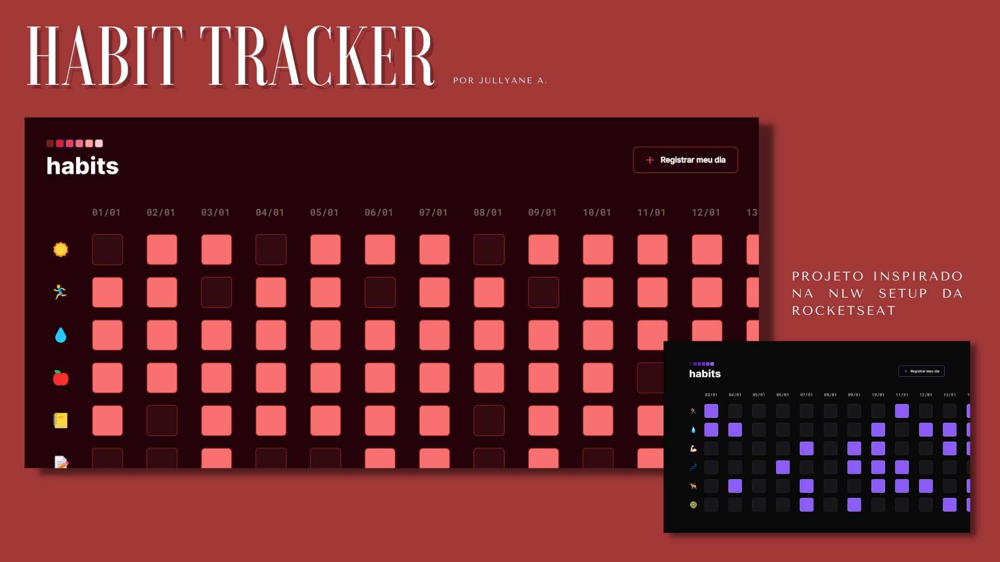

<h1> Habit Tracker </h1>

<a href="https://jullystudies.github.io/nlw-11-setup/" target="_blank">Link do projeto</a>

<h2>Projeto</h2>
    
 ♥ Projeto desenvolvido usando como base o projeto DevLinks da Rocketseat, mudando cores e posicionamento dos elementos.
    

<h2>Linguagens e tecnologias</h2>

<ul>
    <li> HTML
    <li> CSS
    <li> JavaScript
</ul>
